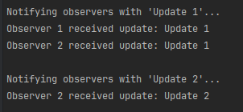

# Behavioral Design Patterns

## Author
**Ciornii Alexandr**

## Objectives
- Get familiar with the Behavioral Design Patterns (BDPs).
- Choose a specific domain.
- Implement at least 1 BDP for the specific domain.

## Used Design Patterns
1. **Observer**

---

## Implementation

### Observer Pattern
**Explanation**:  
The Observer pattern defines a one-to-many dependency between objects so that when one object changes state, all its dependents are notified automatically. This was implemented to allow a Subject to notify multiple Observers with updated information.

**Code Snippet**:
```csharp
using System;
using System.Collections.Generic;

// Concrete Subject
public class Subject<T> : ISubject<T>
{
    private readonly List<IObserver<T>> _observers = new List<IObserver<T>>();

    public void Attach(IObserver<T> observer)
    {
        _observers.Add(observer);
    }

    public void Detach(IObserver<T> observer)
    {
        _observers.Remove(observer);
    }

    public void Notify(T data)
    {
        foreach (var observer in _observers)
        {
            observer.Update(data);
        }
    }
}

// Concrete Observer
public class ConcreteObserver<T> : IObserver<T>
{
    private readonly string _name;

    public ConcreteObserver(string name)
    {
        _name = name;
    }

    public void Update(T data)
    {
        Console.WriteLine($"\{_name} received update: {data}");
    }
}


```

---

## Results / Screenshots
- **Observer 1 Output**: "Observer 1 received update: Update 1".
- **Observer 2 Output**: 
  - "Observer 2 received update: Update 1".
  - "Observer 2 received update: Update 2".
  

---

## Conclusions
- The Observer pattern effectively decouples subjects from their observers, promoting a clean, modular architecture.
- This implementation supports a flexible and extensible notification system.
- The generic nature of the implementation ensures applicability across various domains and data types.
